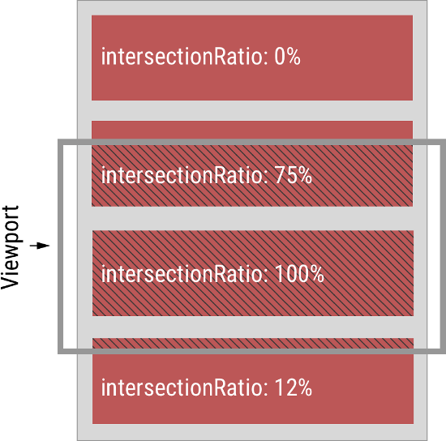

# IntersectionObserver API

## WHY
网页开发时，常常需要了解某个元素是否进入了“视口”(viewport),即用户能不能看见它。  

先看[demo](demo.html)  

- **传统的实现方法**:监听到`scroll`事件后，调用目标元素的`getBoundingClientRect()`方法，得到它对应于视口左上角的坐标，再判断是否在视口之内。这种方法的缺点是，由于`scroll`事件密集发生，计算量很大，容易造成性能问题。

- **目前有一个新的IntersectionObserver API**:可以自动“观察”元素是否可见，由于可见(visible)的本质是，目标元素与视口产生一个交叉区，所以这个API叫做“交叉观察器”。

- [目前Chrome 51+ 已经支持](https://developer.mozilla.org/zh-CN/docs/Web/API/IntersectionObserver#%E6%B5%8F%E8%A7%88%E5%99%A8%E5%85%BC%E5%AE%B9)

## WHAT

MDN Web Docs的解释:
> `IntersectionObserver`接口提供了一种异步观察目标元素与其祖先元素或顶级文档视窗(viewport)交叉状态的方法。祖先元素与视窗(viewport)被称为根(root)。  
>  当一个IntersectionObserver对象被创建时，其被配置为监听根中一段给定比例的可见区域。一旦IntersectionObserver被创建，则无法更改其配置，所以一个给定的观察者对象只能用来监听可见区域的特定变化值；然而，你可以在同一个观察者对象中配置监听多个目标元素。  

## HOW

### 1. API
它的用法非常简单
```javascript
const io = new IntersectionObserver(callback,options)
```
上面代码中，`IntersectionObserver`是浏览器原生提供的构造函数，接受两个参数：
 - `callback` 是可见性变化时的回调函数
 - `options` 是配置对象（该参数可选）

构造函数返回值是一个**观察器**实例，实例的`oberve`方法可以指定观察哪个**DOM节点**。

```javascript
// 开始观察
io.observe(document.getElementById('example'));

// 停止观察
io.unobserve(element);

// 关闭观察器
io.disconnect();
```

如果要观察多个节点，就要多次调用这个方法。  
```javascript
io.observe(elementA);
io.observe(elementB);
//或者遍历nodeList
nodeList.forEach(element=>{
    io.observe(element)
})
```

### 2. callback
目标元素的可见性变化时，就会调用观察器的回调函数`callback`。
`callback`在默认情况下（没有指定threshold），第一次进入网页时会触发一次外，还有两种触发的情况。  

- 目标元素刚刚进入视口（从不可见变为可见）
- 目标元素完全离开视口（开始不可见）  


```javascript
const io = new IntersectionObserver(
    entries =>{
        console.log(entries)
    }
)
```


`callback`函数的参数`entries`是一个数组（见图），每个成员都是一个[IntersectionObserverEntry](https://developer.mozilla.org/zh-CN/docs/Web/API/IntersectionObserverEntry) 对象。

举例来说，如果有两个被观察的对象的可见性发生变化，`entries`数组就会有两个成员。

### 3. IntersectionObserverEntry 对象
`IntersectionObserverEntry`对象提供目标元素的信息，一共有七个属性。~~(其实还有个 isVisible 我不知道是玩意)~~
```javascript
{
    boundingClientRect: DOMRectReadOnly {
        bottom: 53.5,
        height: 200,
        left: 0,
        right: 1296.
        top: -146.5.
        width: 1296.
        x: 0.
        y: -146.5
    },
    intersectionRatio: 0,
    intersectionRect: DOMRectReadOnly {
        //...
    },
    isIntersecting: false,
    rootBounds: DOMRectReadOnly {
        // ...
    },
    target: div.beingOb,
    time: 1905
}
```
每个属性的含义如下

- boundingClientRect: 目标元素的矩形区域的信息 
- intersectionRatio: 目标元素可见比例，即 intersectionRect 占 intersectionClientRect 的比例，完全可见时为1，完全不可见时小于等于0
- intersectionRect: 目标元素与视口（或根元素）的交叉区域的信息 
- isIntersecting: 布尔值，目标元素与视口（或根元素）是否相交
- rootBounds: 根元素的矩形区域的信息，`getBoundingClientRect()` 方法的返回值
- target: 被观察的目标元素，是一个 DOM 节点对象
- time: 可见性发生变化的时间，是一个高精度时间戳，单位为毫秒  

  

上图中，灰色的水平方框代表视口，深红色的区域代表四个被观察的目标元素。它们各自的 `intersectionRatio` 图中都已经注明。  
我也写了一个 [Demo](demo2.html) ，演示 `IntersectionObserverEntry`对象。注意，这个Demo只能在Chrome51+ 运行。

> 此demo希望完整演示API的工作,让大家感受到变化,故将根元素的矩形区域限制为页面中央的方框里，下同。

### 4. 实例：惰性加载 (lazy load)
有时，我们希望某些静态资源（比如图片），只有用户向下滚动，他们进入视口时才加载，这样可以节省带宽，提高网页性能，即"懒加载"。  
有了 IntersectionObserver API ，实现起来就很容易了。

```javascript
function query(selector) {
  return Array.from(document.querySelectorAll(selector));
}

var observer = new IntersectionObserver(
  function(changes) {
    changes.forEach(function(change) {
        if(change.isIntersecting){
            var container = change.target;
            var content = container.querySelector('template').content;
            container.appendChild(content);
            observer.unobserve(container);
        }
    });
  }
);

query('.lazy-loaded').forEach(function (item) {
  observer.observe(item);
});
```
效果见[Demo(懒加载)](demo3.html)

### 5. 实例：无限滚动
无限滚动 (infinite scroll) 的实现也很简单。
```javascript
var intersectionObserver = new IntersectionObserver(
  function (entries) {
    // 如果不可见，就返回
    if (entries[0].intersectionRatio <= 0) return;
    loadItems(10);
    console.log('Loaded new items');
  });

// 开始观察
intersectionObserver.observe(
  document.querySelector('.scrollerFooter')
);
```
无限滚动时，最好在页面底部有一个页尾栏（又称sentinels）。一旦页尾栏可见，就表示用户到达了页面底部，从而加载新的条目放在页尾栏前面。这样做的好处是，不需要再一次调用`observe()`方法，现有的`IntersectionObserver`可以保持使用。
效果见[Demo(无限滚动)](demo4.html)


### 6. option 对象
#### 6.1 threshold属性
`threshold`属性决定了什么时候触发回调函数。它是一个数组，每个成员都是一个门槛值，默认为`[0]`，即交叉比例（`intersectionRatio`）达到`0`时触发回调函数。

```javascript
new IntersectionObserver(
  entries => {/* ... */}, 
  {
    threshold: [0, 0.25, 0.5, 0.75, 1]
  }
);
```
用户可以自定义这个数组。比如，`[0, 0.25, 0.5, 0.75, 1]`就表示当目标元素 0%、25%、50%、75%、100% 可见时，会触发回调函数。

#### 6.2 root 属性，rootMargin 属性  
很多时候，目标元素不仅会随着窗口滚动，还会在容器里面滚动（比如在`iframe`窗口里滚动）。容器内滚动也会影响目标元素的可见性。

IntersectionObserver API 支持容器内滚动。`root`属性指定目标元素所在的容器节点（即根元素）。注意，容器元素必须是目标元素的祖先节点。  
```javascript
var opts = { 
  root: document.querySelector('.container'),
  rootMargin: "500px 0px" 
};

var observer = new IntersectionObserver(
  callback,
  opts
);
```
上面代码中，除了`root`属性，还有`rootMargin`属性。后者定义根元素的`margin`，用来扩展或缩小`rootBounds`这个矩形的大小，从而影响`intersectionRect`交叉区域的大小。它使用CSS的定义方法，比如`10px 20px 30px 40px`，表示 top、right、bottom 和 left 四个方向的值。

这样设置以后，不管是窗口滚动或者容器内滚动，只要目标元素可见性变化，都会触发观察器。  

### 7. 注意点
IntersectionObserver API 是异步的，不随着目标元素的滚动同步触发。

规格写明，`IntersectionObserver`的实现，应该采用`requestIdleCallback()`，即只有线程空闲下来，才会执行观察器。这意味着，这个观察器的优先级非常低，只在其他任务执行完，浏览器有了空闲才会执行。

